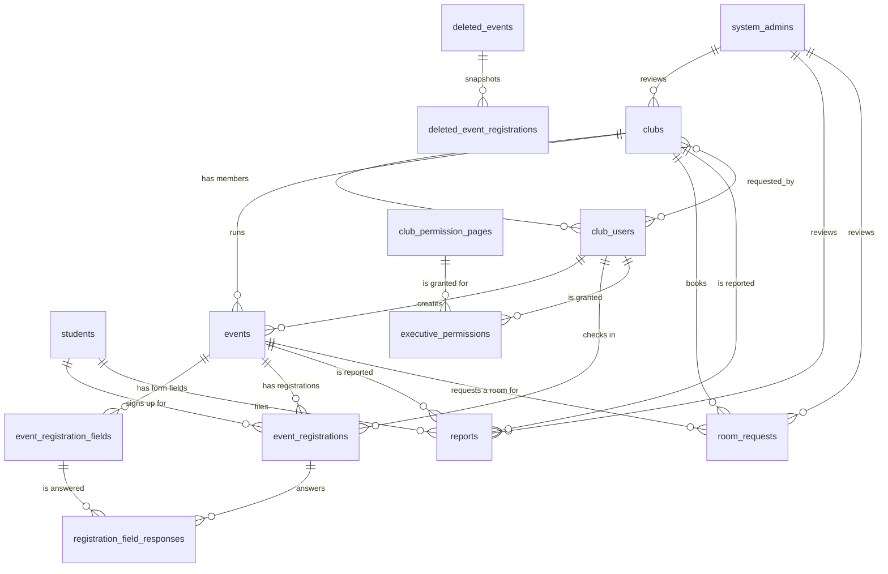

# Eventrify — Database Report

A complete, query-verified map of the Eventrify database: every table, every column,
every relationship, and what actually happens when a row is deleted.

- **Database:** `eventrify`
- **Engine / charset:** InnoDB, `utf8mb4` / `utf8mb4_unicode_ci`
- **Authoritative schema:** [`../database/finalschema.sql`](../database/finalschema.sql)
- **Verified against the live database** on 2026-09-30 — all 21 foreign keys, their
  delete rules, and every index match the SQL file exactly. No drift in structure.

---

## 1. At a glance

14 tables, 21 foreign keys, 8 custom indexes, 6 unique constraints beyond the primary keys.

| # | Table | Purpose | Rows |
|---|-------|---------|-----:|
| 1 | `students` | Student login and profile | 4 |
| 2 | `system_admins` | Platform administrator login | 1 |
| 3 | `clubs` | Club registration and approval state | 5 |
| 4 | `club_users` | Club members, roles, access scope | 6 |
| 5 | `club_permission_pages` | Static lookup of governable pages | 7 |
| 6 | `executive_permissions` | Per-page grants for `executive` members | 0 |
| 7 | `events` | Events belonging to a club | 6 |
| 8 | `event_registration_fields` | Per-event registration form builder | 28 |
| 9 | `event_registrations` | Who is on the list for an event | 8 |
| 10 | `registration_field_responses` | Answers to the custom form questions | 0 |
| 11 | `reports` | Student reports against a club or event | 2 |
| 12 | `room_requests` | Room/slot booking requests | 4 |
| 13 | `deleted_events` | Admin archive of removed events | 1 |
| 14 | `deleted_event_registrations` | Registration snapshot inside the archive | 0 |

---

## 2. How the tables group

Five domains. Each is self-contained, and cross-domain links are always optional
(nullable) so one domain can be wiped without destroying another.

| Domain | Tables | Root |
|--------|--------|------|
| Identity | `students`, `system_admins`, `club_users` | — (three separate login realms) |
| Clubs | `clubs`, `club_permission_pages`, `executive_permissions` | `clubs` |
| Events | `events`, `event_registration_fields`, `event_registrations`, `registration_field_responses` | `events` |
| Moderation | `reports`, `room_requests` | `students`, `clubs` |
| Archive | `deleted_events`, `deleted_event_registrations` | `deleted_events` |

**The single most important structural fact:** there are three unrelated login
tables, not one `users` table. `students`, `club_users`, and `system_admins` each
carry their own `email` + `password_hash` and are never joined to one another.
The schema file deliberately dropped an older flat `users` table for this reason.

---

## 3. Entity-relationship diagram



Note the deliberate break in the middle of the diagram: `deleted_events` and
`deleted_event_registrations` reference **nothing**. The archive is a dead end by
design (see section 7).

---

## 4. Every relationship, with its delete rule

`ON DELETE CASCADE` = child rows disappear with the parent. `SET NULL` = the link
is erased but the child row survives. `RESTRICT` = the delete is **refused**.

| Child column | Parent | Rule | Meaning if parent is deleted |
|---|---|---|---|
| `event_registrations.student_id` | `students` | CASCADE | their registrations are removed |
| `reports.reporter_id` | `students` | CASCADE | their reports are removed |
| `clubs.reviewed_by` | `system_admins` | RESTRICT | admin cannot be deleted while they reviewed a club |
| `reports.reviewed_by` | `system_admins` | RESTRICT | admin cannot be deleted while they reviewed a report |
| `room_requests.reviewed_by` | `system_admins` | RESTRICT | admin cannot be deleted while they reviewed a request |
| `club_users.club_id` | `clubs` | CASCADE | all members removed with the club |
| `events.club_id` | `clubs` | CASCADE | all events removed with the club |
| `room_requests.club_id` | `clubs` | CASCADE | all booking requests removed with the club |
| `reports.reported_club_id` | `clubs` | SET NULL | report survives, loses the club link |
| `clubs.requested_by` | `club_users` | RESTRICT | the requesting member cannot be deleted |
| `events.created_by` | `club_users` | RESTRICT | the creating member cannot be deleted |
| `event_registrations.checked_in_by` | `club_users` | RESTRICT | the checking-in member cannot be deleted |
| `executive_permissions.club_user_id` | `club_users` | CASCADE | grants removed with the member |
| `executive_permissions.page_id` | `club_permission_pages` | CASCADE | grants removed with the page |
| `event_registration_fields.event_id` | `events` | CASCADE | form fields removed with the event |
| `event_registrations.event_id` | `events` | CASCADE | registrations removed with the event |
| `reports.reported_event_id` | `events` | SET NULL | report survives, loses the event link |
| `room_requests.event_id` | `events` | SET NULL | request survives, becomes a standalone booking |
| `registration_field_responses.registration_id` | `event_registrations` | CASCADE | answers removed with the registration |
| `registration_field_responses.field_id` | `event_registration_fields` | CASCADE | answers removed with the question |
| `deleted_event_registrations.deleted_event_id` | `deleted_events` | CASCADE | snapshot removed with the archive row |

**Totals:** 12 CASCADE, 3 SET NULL, 6 RESTRICT.

### The one circular reference

`clubs` and `club_users` point at each other:

- `club_users.club_id` → `clubs.club_id` (CASCADE)
- `clubs.requested_by` → `club_users.club_user_id` (RESTRICT)

This is legal and intentional — a club records who applied for it — but it has a
real consequence documented in section 8.

---

## 5. Delete cascade chains

What actually disappears when you delete one row, following the chain to the end.

**Delete a `student`**
```
event_registrations (CASCADE)  →  registration_field_responses (CASCADE)
reports (CASCADE)
```

**Delete a `club`**
```
club_users (CASCADE)  →  executive_permissions (CASCADE)
events (CASCADE)  →  event_registration_fields (CASCADE)  →  registration_field_responses (CASCADE)
                  →  event_registrations (CASCADE)  →  registration_field_responses (CASCADE)
room_requests (CASCADE)
reports (SET NULL)   ← report rows survive, link erased
students             ← untouched
```

**Delete an `event`**
```
event_registration_fields (CASCADE)  →  registration_field_responses (CASCADE)
event_registrations (CASCADE)        →  registration_field_responses (CASCADE)
reports (SET NULL)
room_requests (SET NULL)
```

**Delete a `club_user`**
```
executive_permissions (CASCADE)
clubs.requested_by, events.created_by, event_registrations.checked_in_by → all RESTRICT, so
this is usually refused. See section 8.
```

**Delete a `deleted_events` archive row**
```
deleted_event_registrations (CASCADE)
```
Nothing else is touched — the archive is isolated.

---

## 6. Table-by-table reference

### `students` — 4 rows
Student login. `student_id` is the internal key; `university_id` is the human ID and
is the value other tables quote.

| Column | Type | Notes |
|---|---|---|
| `student_id` | INT PK AUTO_INCREMENT | referenced by registrations and reports |
| `university_id` | VARCHAR(20) **UNIQUE** | e.g. `0112211234` |
| `email` | VARCHAR(100) **UNIQUE** | login handle |
| `password_hash` | VARCHAR(255) | bcrypt |
| `department`, `batch`, `phone`, `interests`, `profile_picture` | | profile |
| `is_active` | BOOLEAN DEFAULT TRUE | soft disable |

### `system_admins` — 1 row
The only platform-wide administrator. Reviews clubs, reports, and room requests.

| Column | Type | Notes |
|---|---|---|
| `admin_id` | INT PK | |
| `email` | VARCHAR(100) **UNIQUE** | `admin@eventrify.com` |
| `password_hash` | VARCHAR(255) | change before real use |

No `is_active` and no soft-delete — this table is bare.

### `clubs` — 5 rows
| Column | Type | Notes |
|---|---|---|
| `club_id` | INT PK | |
| `club_name` | VARCHAR(100) **UNIQUE** | |
| `requested_by` | INT FK → `club_users` RESTRICT | who applied; **nullable** |
| `reviewed_by` | INT FK → `system_admins` RESTRICT | **nullable** |
| `status` | ENUM(`pending`,`approved`,`rejected`) DEFAULT `pending` | |
| `logo` | LONGTEXT | base64-encoded image, not a path |
| `reviewed_at` | TIMESTAMP NULL | set when approved/rejected |

### `club_users` — 6 rows
| Column | Type | Notes |
|---|---|---|
| `club_user_id` | INT PK | |
| `email` | VARCHAR(100) **UNIQUE** | global unique across all clubs |
| `role` | ENUM(`owner`,`admin`,`executive`) DEFAULT `executive` | |
| `access_scope` | ENUM(`all`,`limited`) DEFAULT `all` | |
| `status` | ENUM(`active`,`inactive`,`removed`) DEFAULT `active` | |
| `student_id` | VARCHAR(20) | **not an FK** — see section 9 |

### `club_permission_pages` — 7 rows
Static lookup, seeded once. `page_key` values: `club_profile`, `members`, `events`,
`attendance`, `registrations`, `reports`, `room_requests`.

### `executive_permissions` — 0 rows
Junction table. Composite PK `(club_user_id, page_id)` so the same page cannot be
granted twice. `access_level` is `view` or `manage`. Currently empty, so the
fine-grained executive control is defined but unused in the seed data.

### `events` — 6 rows
| Column | Type | Notes |
|---|---|---|
| `event_id` | INT PK | |
| `club_id` | INT FK → `clubs` CASCADE | owning club |
| `created_by` | INT FK → `club_users` RESTRICT | **NOT NULL** — see section 8 |
| `start_time`, `end_time` | DATETIME **NOT NULL** | `end_time` must be after `start_time` |
| `registration_deadline` | DATETIME NULL | must be before `start_time` |
| `capacity` | INT NOT NULL DEFAULT 0 | |
| `status` | ENUM(`draft`,`published`,`cancelled`,`completed`) | |
| `poster` | LONGTEXT | base64 image |
| `venue` | VARCHAR(150) | free text, **not** a room table |

Index `idx_events_club_status (club_id, status)` serves the club dashboard list.

### `event_registration_fields` — 28 rows
Per-event form builder.

| Column | Type | Notes |
|---|---|---|
| `field_type` | ENUM(`text`,`number`,`email`,`dropdown`,`checkbox`,`date`) | |
| `field_options` | TEXT | comma-separated, for dropdown/checkbox |
| `is_required` | BOOLEAN | |
| `display_order` | INT | render order |

Every event gets the four defaults (Full Name, Email, Student ID, Department) from
a seed-time `CROSS JOIN`; only event 1 has extra custom questions.

### `event_registrations` — 8 rows
| Column | Type | Notes |
|---|---|---|
| `student_id` | INT FK → `students` CASCADE | **nullable** |
| `guest_name`, `guest_student_id` | | **nullable** — used when there is no student |
| `is_walkin` | BOOLEAN DEFAULT FALSE | |
| `status` | ENUM(`registered`,`waitlisted`,`cancelled`,`attended`,`no_show`) | |
| `waitlist_position` | INT NULL | |
| `checked_in_at` | TIMESTAMP NULL | |
| `check_in_method` | ENUM(`qr`,`student_id`,`manual`) NULL | |
| `checked_in_by` | INT FK → `club_users` RESTRICT | nullable |

`UNIQUE KEY uq_event_student (event_id, student_id)` stops the same student
registering twice for one event. **Caveat:** in MySQL a `UNIQUE` index treats
`NULL` as distinct, so this key does **not** actually prevent duplicate walk-in
rows when `student_id` is NULL — that has to be enforced in application code.

### `registration_field_responses` — 0 rows
Junction between a registration and a question.
`UNIQUE` is **missing** on `(registration_id, field_id)`, so the same question can
be answered more than once for one registration.

### `reports` — 2 rows
| Column | Type | Notes |
|---|---|---|
| `reporter_id` | INT FK → `students` CASCADE | NOT NULL |
| `reported_club_id` | INT FK → `clubs` SET NULL | nullable |
| `reported_event_id` | INT FK → `events` SET NULL | nullable |
| `status` | ENUM(`open`,`under_review`,`resolved`,`dismissed`) | |
| `resolved_at` | TIMESTAMP NULL | |

A report is **polymorphic**: at least one of `reported_club_id` / `reported_event_id`
carries the target, and both may be NULL for a general feature suggestion. Nothing
in the schema enforces "at least one is set" — report 2 is a suggestion with both
columns NULL. Any query filtering "reports about event X" must therefore use
`WHERE reported_event_id = ?`, not assume a club is also set.

### `room_requests` — 4 rows
| Column | Type | Notes |
|---|---|---|
| `club_id` | INT FK → `clubs` CASCADE | NOT NULL |
| `event_id` | INT FK → `events` **SET NULL** | nullable — becomes a standalone booking |
| `requested_date` | DATE NOT NULL | |
| `start_time`, `end_time` | TIME NOT NULL | one fixed slot |
| `expected_participants` | INT DEFAULT 0 | |
| `preferred_room` | VARCHAR(100) | free text |
| `status` | ENUM(`pending`,`approved`,`declined`) | |
| `review_notes` | TEXT | |
| `reviewed_by` | INT FK → `system_admins` RESTRICT | nullable |

**There is no `rooms` table and no foreign key on `preferred_room`.** The room
catalogue is derived at query time from `events.venue` and the distinct
`room_requests.preferred_room` values. Room identity is free text, so
"Lab 104, Science Building" and "lab 104 science building" are different rooms.
Time slots are likewise not stored in a table — the six fixed slots are defined in
PHP (`app/helpers/rooms.php`), and one request row represents exactly one slot.

### `deleted_events` — 1 row
The admin archive. **Every column is a deliberate plain copy, not a foreign key.**

| Column | Notes |
|---|---|
| `event_id` | the id it had on `events` — the same value can appear more than once |
| `club_name`, `student_name`, `deleted_by_name` | snapshot text |
| `status` | **VARCHAR(20), not ENUM** so archived rows survive an enum change |
| `registration_count` | how many were on the list at deletion |
| `deleted_at`, `delete_reason` | |
| Indexes | `idx_deleted_events_deleted_at`, `idx_deleted_events_event` |

### `deleted_event_registrations` — 0 rows
Snapshot of the registration list at deletion time, joined only to
`deleted_events`. Student name, university ID, and email are copied onto the row so
the record does not change when somebody later corrects their spelling.

---

## 7. Why the archive tables have no foreign keys

This is the one place where "no FK" is the correct design, and it is worth
understanding before changing it.

When an admin deletes an event, the row is copied into `deleted_events` first,
because the `DELETE` will cascade away its registrations, form fields, and answers.
If the archive referenced `clubs`, `club_users`, or `students` directly, then
deleting the club or the student later would either be blocked or would null the
history out. A history row has to keep describing the event long after everything it
referenced is gone, so the archive is intentionally a self-contained dead end.

The one exception is `deleted_event_registrations` → `deleted_events`, which is
CASCADE: an archive row is meaningless without its event snapshot, so the snapshots
follow it.

---

## 8. Verified behaviour: deleting a club

Tested live inside a transaction and rolled back. The result is a genuine
structural dead end worth knowing about before you write any "delete club" feature.

```sql
DELETE FROM clubs WHERE club_id = 1;
-- ERROR 1451: Cannot delete or update a parent row: a foreign key constraint fails
--             (`clubs`, CONSTRAINT `fk_clubs_requested_by`
--             FOREIGN KEY (`requested_by`) REFERENCES `club_users`)
```

The problem is that `clubs` both **owns** `club_users` (CASCADE) and **points at**
one of them (`requested_by`, RESTRICT). InnoDB checks the RESTRICT constraint
before it performs the cascade, so the delete is refused immediately.

Clearing that one link is not enough either:

```sql
UPDATE clubs SET requested_by = NULL WHERE club_id = 1;
DELETE FROM clubs WHERE club_id = 1;
-- ERROR 1451: ... (`events`, CONSTRAINT `fk_events_created_by`
--             FOREIGN KEY (`created_by`) REFERENCES `club_users`)
```

And that link cannot simply be nulled, because `events.created_by` is `NOT NULL`:

```sql
UPDATE events SET created_by = NULL WHERE club_id = 1;
-- ERROR 1048: Column 'created_by' cannot be null
```

**The only working sequence** is to repoint every RESTRICT reference at a surviving
row first:

```sql
START TRANSACTION;
UPDATE clubs SET requested_by = NULL WHERE club_id = 1;
UPDATE events SET created_by = 3 WHERE club_id = 1;   -- another club's user
UPDATE event_registrations r
  JOIN events e ON e.event_id = r.event_id
  SET r.checked_in_by = NULL WHERE e.club_id = 1;
DELETE FROM clubs WHERE club_id = 1;
COMMIT;
```

Verified outcome after that delete: 2 members, 3 events, 4 form fields, 8
registrations, and 3 room requests all removed by cascade; both report rows
**survive** with `reported_club_id` set to NULL by the SET NULL rule; all 4
students untouched.

**Recommendation:** if club deletion is ever needed, drop the six RESTRICT rules
that point *into* a cascading parent and let `events.created_by` become nullable,
or resolve the ordering in application code with a transaction. Right now the
schema cannot express "delete a club" in a single statement.

---

## 9. Verified data-quality findings

Run against the live database. Zero is good; non-zero is a finding.

| Check | Result | Notes |
|---|---:|---|
| Registrations with neither a student nor a guest name | 0 | the OR-pattern is respected today |
| Registrations with both a student and a guest name | 0 | |
| `waitlisted` rows with no `waitlist_position` | **1** | registration 3 on event 1 — position is never assigned |
| `attended` rows with no `checked_in_at` | 0 | |
| Rows with a `check_in_method` but no `checked_in_at` | 0 | |
| Events where `end_time <= start_time` | 0 | |
| Events where `registration_deadline >= start_time` | 0 | |
| Room requests where `end_time <= start_time` | 0 | |
| Events with zero registration fields | 0 | the default-fields seed covers all |
| Orphan `registration_field_responses` | 0 | |
| **`club_users.student_id` values with no matching student** | **5** | of 6 — see below |

### The `club_users.student_id` soft link

`club_users.student_id` is a `VARCHAR(20)` that looks like it should reference
`students`, but **there is no foreign key** and it points at `students.university_id`
rather than `students.student_id`. Nothing enforces that a club member is a
registered student.

```sql
SELECT cu.email, cu.student_id, s.student_id AS matched_student
FROM club_users cu
LEFT JOIN students s ON s.university_id = cu.student_id;
```

| email | `club_users.student_id` | matched student |
|---|---|---|
| mahi@gmail.com | 0112210001 | NULL |
| fahim.robotics@example.com | 0112210002 | NULL |
| tasnim.prog@example.com | 0112220001 | NULL |
| sadia.ai@example.com | 0112230001 | NULL |
| nusrat.cultural@uiu.edu.bd | 0112440567 | 4 |
| tanvir.business@uiu.edu.bd | 0112550123 | NULL |

Five of six do not correspond to any student. That is expected for the demo data —
presidents hold office without being in the `students` table — but it means the
column cannot be trusted as a link. Any feature that needs "the student behind this
club member" must LEFT JOIN and handle NULL.

### Waitlist positions are never assigned

Registration 3 (Rakib Hasan, event 1) is `waitlisted` with
`waitlist_position = NULL`. Nothing in the current seed or schema computes it; the
position has to be derived at read time, for example:

```sql
SELECT r.registration_id, s.full_name
FROM event_registrations r
JOIN students s ON s.student_id = r.student_id
WHERE r.event_id = 1 AND r.status = 'waitlisted'
ORDER BY r.registered_at;
```

---

## 10. Query cookbook

Verified queries, with the results from the current database.

### 10.1 Every event with capacity, live registrations, and seats left

`registered` and `attended` count as occupying a seat; `waitlisted` and `cancelled`
do not.

```sql
SELECT e.event_id, e.title, e.status, e.capacity,
       COUNT(r.registration_id) AS total_rows,
       SUM(r.status IN ('registered','attended')) AS live,
       e.capacity - COUNT(r.registration_id) AS seats_left,
       e.venue
FROM events e
LEFT JOIN event_registrations r ON r.event_id = e.event_id
GROUP BY e.event_id
ORDER BY e.event_id;
```

| event_id | title | status | capacity | total_rows | live | seats_left |
|---:|---|---|---:|---:|---:|---:|
| 1 | Intro to AI Workshop | published | 80 | 3 | 2 | 77 |
| 2 | Inter-University Robotics Competition | published | 200 | 2 | 2 | 198 |
| 3 | Beginner Arduino Bootcamp | published | 50 | 0 | 0 | 50 |
| 4 | Web Development Bootcamp | published | 100 | 2 | 2 | 98 |
| 5 | ICPC Practice Contest #1 | published | 60 | 1 | 1 | 59 |
| 6 | Research Methodology Seminar | published | 150 | 0 | 0 | 150 |

### 10.2 The full registration list with student names

```sql
SELECT r.registration_id, r.event_id, e.title,
       COALESCE(s.full_name, r.guest_name) AS who,
       r.is_walkin, r.status, r.waitlist_position, r.registered_at
FROM event_registrations r
JOIN events e ON e.event_id = r.event_id
LEFT JOIN students s ON s.student_id = r.student_id
ORDER BY r.event_id, r.registration_id;
```

`COALESCE(s.full_name, r.guest_name)` is the standard way to read a row that may
hold either a student FK or a guest name.

### 10.3 Spot a student who would fill an event

```sql
SELECT e.title, s.full_name, r.status
FROM event_registrations r
JOIN events e ON e.event_id = r.event_id
JOIN students s ON s.student_id = r.student_id
WHERE s.student_id = 1
ORDER BY e.start_time;
```

### 10.4 Check a new registration will not overfill an event

```sql
SELECT e.event_id, e.title, e.capacity,
       COUNT(*) AS live
FROM events e
JOIN event_registrations r ON r.event_id = e.event_id
WHERE e.event_id = ?
  AND r.status IN ('registered','attended')
GROUP BY e.event_id, e.title, e.capacity
HAVING live >= e.capacity;
```

Zero rows returned means there is still room.

### 10.5 Registration form for an event, in render order

```sql
SELECT field_id, field_label, field_type, field_options, is_required, display_order
FROM event_registration_fields
WHERE event_id = 1
ORDER BY display_order, field_id;
```

Event 1 returns 8 rows — the four defaults plus four custom questions. Events 2–6
return only the four defaults.

### 10.6 A student's full registration history with their answers

```sql
SELECT e.title, e.start_time, r.status, r.registered_at,
       f.field_label, fr.response_value
FROM event_registrations r
JOIN events e ON e.event_id = r.event_id
LEFT JOIN registration_field_responses fr ON fr.registration_id = r.registration_id
LEFT JOIN event_registration_fields f ON f.field_id = fr.field_id
WHERE r.student_id = ?
ORDER BY e.start_time, f.display_order;
```

The `LEFT JOIN`s matter: a registration with no answers still has to appear.

### 10.7 Room requests with the club and event named

```sql
SELECT rq.request_id, c.club_name, e.title,
       rq.requested_date,
       TIME_FORMAT(rq.start_time, '%h:%i %p') AS slot_start,
       TIME_FORMAT(rq.end_time,   '%h:%i %p') AS slot_end,
       rq.preferred_room, rq.status
FROM room_requests rq
JOIN clubs c ON c.club_id = rq.club_id
LEFT JOIN events e ON e.event_id = rq.event_id
ORDER BY rq.requested_date, rq.start_time;
```

| request_id | club_name | title | requested_date | slot_start | slot_end | status |
|---:|---|---|---|---|---|---|
| 4 | UIU Programming League | Web Development Bootcamp | 2026-10-16 | 03:10 PM | 04:30 PM | declined |
| 2 | UIU AI & Machine Learning Club | Research Methodology Seminar | 2026-10-20 | 09:50 AM | 11:10 AM | approved |
| 1 | UIU Robotics Club | Inter-University Robotics Competition | 2026-11-14 | 08:30 AM | 09:50 AM | pending |
| 3 | UIU Robotics Club | *NULL* | 2026-12-01 | 12:30 PM | 01:40 PM | pending |

Request 3 shows the SET NULL rule in action: it was linked to event 7, that event
was deleted, and the request survived as a standalone booking with `event_id` now
NULL.

### 10.8 Detect two clubs fighting over the same room and slot

```sql
SELECT a.preferred_room, a.requested_date, a.start_time, a.end_time,
       a.club_id, b.club_id AS clashes_with
FROM room_requests a
JOIN room_requests b
  ON  a.preferred_room  = b.preferred_room
  AND a.requested_date  = b.requested_date
  AND a.start_time      < b.end_time
  AND b.start_time      < a.end_time
  AND a.request_id     <> b.request_id
WHERE a.status IN ('pending','approved')
  AND b.status IN ('pending','approved');
```

Only `pending` and `approved` block a slot. Note the comparison is exact string
equality on `preferred_room` — the free-text problem from section 6 means this
query will miss case or punctuation differences.

### 10.9 Derive the room catalogue (what the app does at read time)

```sql
SELECT venue AS room, MAX(capacity) AS largest_capacity
FROM events
WHERE venue IS NOT NULL AND venue <> ''
GROUP BY venue
ORDER BY venue;
```

```sql
SELECT DISTINCT preferred_room AS room
FROM room_requests
WHERE preferred_room IS NOT NULL AND preferred_room <> '';
```

The application unions these two sets and falls back to a hardcoded list when the
result is empty. There is no room master table to query.

### 10.10 Verify a linked room request agrees with its event

```sql
SELECT rq.request_id, rq.expected_participants, e.capacity, e.title
FROM room_requests rq
JOIN events e ON e.event_id = rq.event_id
WHERE rq.expected_participants <> e.capacity;
```

Returns 0 rows — every linked request currently matches its event's capacity.

### 10.11 Reports, with whichever target is set

```sql
SELECT rp.report_id, s.full_name AS reporter,
       COALESCE(e.title, c.club_name, 'General suggestion') AS target,
       rp.status, rp.subject, rp.created_at
FROM reports rp
JOIN students s ON s.student_id = rp.reporter_id
LEFT JOIN events e ON e.event_id = rp.reported_event_id
LEFT JOIN clubs c ON c.club_id = rp.reported_club_id
ORDER BY rp.created_at DESC;
```

The two-level `COALESCE` is required because both target columns are nullable.

### 10.12 Admin deletion queue — what still blocks a removal

The five `status` values treated as live (occupancy) versus historical.

```sql
SELECT e.event_id, e.title,
       SUM(r.status IN ('registered','waitlisted','attended')) AS live_rows,
       SUM(r.status IN ('cancelled','no_show')) AS historical_rows
FROM events e
LEFT JOIN event_registrations r ON r.event_id = e.event_id
GROUP BY e.event_id
HAVING live_rows > 0;
```

### 10.13 The archive, readable on its own

```sql
SELECT d.deleted_event_id, d.event_id, d.club_name, d.title, d.status,
       d.start_time, d.registration_count, d.deleted_by_name,
       d.delete_reason, d.deleted_at,
       COUNT(a.archive_id) AS snapshotted_registrations
FROM deleted_events d
LEFT JOIN deleted_event_registrations a
       ON a.deleted_event_id = d.deleted_event_id
GROUP BY d.deleted_event_id
ORDER BY d.deleted_at DESC;
```

| deleted_event_id | event_id | club_name | title | registration_count | deleted_by_name | delete_reason | snapshotted |
|---:|---:|---|---|---:|---|---|---:|
| 3 | 7 | UIU Robotics Club | Robotics Demo Day | 0 | System Administrator | Has Some Issues | 0 |

No join to `clubs` is possible or needed — the club name is stored on the row.

### 10.14 Effective access for a club member

Join the member to their per-page grants. `access_scope = 'all'` short-circuits
everything, so those members need no rows in `executive_permissions` at all.

```sql
SELECT cu.club_user_id, cu.full_name, cu.role, cu.access_scope,
       p.page_key, ep.access_level
FROM club_users cu
LEFT JOIN executive_permissions ep ON ep.club_user_id = cu.club_user_id
LEFT JOIN club_permission_pages p ON p.page_id = ep.page_id
WHERE cu.club_id = 1
ORDER BY cu.club_user_id, p.page_key;
```

### 10.15 Events with their club, for the public/club listing

`idx_events_club_status (club_id, status)` serves this directly.

```sql
SELECT c.club_name, e.event_id, e.title, e.category, e.venue,
       e.start_time, e.end_time, e.registration_deadline, e.capacity,
       SUM(r.status IN ('registered','attended')) AS taken
FROM events e
JOIN clubs c ON c.club_id = e.club_id
LEFT JOIN event_registrations r ON r.event_id = e.event_id
WHERE e.status = 'published' AND c.status = 'approved'
GROUP BY e.event_id, c.club_name
ORDER BY e.start_time;
```

### 10.16 Full integrity sweep

The complete set from section 9 as one runnable script.

```sql
SELECT 'registration with neither student nor guest' AS check_name, COUNT(*) AS violations
  FROM event_registrations WHERE student_id IS NULL AND guest_name IS NULL
UNION ALL SELECT 'registration with both student and guest',
  COUNT(*) FROM event_registrations WHERE student_id IS NOT NULL AND guest_name IS NOT NULL
UNION ALL SELECT 'waitlisted without waitlist_position',
  COUNT(*) FROM event_registrations WHERE status='waitlisted' AND waitlist_position IS NULL
UNION ALL SELECT 'attended without checked_in_at',
  COUNT(*) FROM event_registrations WHERE status='attended' AND checked_in_at IS NULL
UNION ALL SELECT 'check_in_method without checked_in_at',
  COUNT(*) FROM event_registrations WHERE check_in_method IS NOT NULL AND checked_in_at IS NULL
UNION ALL SELECT 'event ending at or before its start',
  COUNT(*) FROM events WHERE end_time <= start_time
UNION ALL SELECT 'event deadline at or after its start',
  COUNT(*) FROM events WHERE registration_deadline IS NOT NULL AND registration_deadline >= start_time
UNION ALL SELECT 'room request ending at or before its start',
  COUNT(*) FROM room_requests WHERE end_time <= start_time
UNION ALL SELECT 'event with no registration fields',
  COUNT(*) FROM events e WHERE NOT EXISTS (
    SELECT 1 FROM event_registration_fields f WHERE f.event_id = e.event_id)
UNION ALL SELECT 'club_users.student_id not in students',
  COUNT(*) FROM club_users cu WHERE cu.student_id IS NOT NULL AND NOT EXISTS (
    SELECT 1 FROM students s WHERE s.university_id = cu.student_id)
UNION ALL SELECT 'executive with no permission rows',
  COUNT(*) FROM club_users cu WHERE cu.role='executive' AND NOT EXISTS (
    SELECT 1 FROM executive_permissions p WHERE p.club_user_id = cu.club_user_id)
UNION ALL SELECT 'orphan response rows',
  COUNT(*) FROM registration_field_responses r WHERE NOT EXISTS (
    SELECT 1 FROM event_registrations g WHERE g.registration_id = r.registration_id);
```

---

## 11. Constraints and indexes

| Table | Name | Columns | Type | Why |
|---|---|---|---|---|
| `clubs` | `club_name` | `club_name` | UNIQUE | no duplicate club names |
| `club_permission_pages` | `page_key` | `page_key` | UNIQUE | stable code for each page |
| `club_users` | `email` | `email` | UNIQUE | login handle, global across clubs |
| `students` | `university_id` | `university_id` | UNIQUE | the ID other tables quote |
| `students` | `email` | `email` | UNIQUE | login handle |
| `system_admins` | `email` | `email` | UNIQUE | login handle |
| `executive_permissions` | PRIMARY | `club_user_id, page_id` | composite | a page cannot be granted twice |
| `event_registrations` | `uq_event_student` | `event_id, student_id` | UNIQUE | one registration per student per event |
| `events` | `idx_events_club_status` | `club_id, status` | index | club dashboard listing |
| `event_registrations` | `idx_reg_event_status` | `event_id, status` | index | live-registration counting |
| `deleted_events` | `idx_deleted_events_deleted_at` | `deleted_at` | index | archive sorted newest first |
| `deleted_events` | `idx_deleted_events_event` | `event_id` | index | look up an event's history |
| `deleted_event_registrations` | `idx_deleted_regs_archive` | `deleted_event_id` | index | fetch the snapshot |

MySQL builds an index automatically for every foreign key; those are not listed
separately.

**Missing, and worth adding:**

- `registration_field_responses` has no unique key on `(registration_id, field_id)`,
  so duplicate answers are possible.
- `students.email`, `club_users.email`, and `system_admins.email` are each unique
  *within their own table*, but a person could hold the same address in two of
  them. Cross-table uniqueness is not expressible without a trigger.

---

## 12. Rules the application layer enforces

Things the schema permits but the code must guarantee. Each is a place where a
hand-crafted POST could produce bad data.

| Rule | Where it is enforced |
|---|---|
| `events.end_time > events.start_time` | `pages/dashboard-b/events/edit.php`, `create.php` |
| `events.registration_deadline < events.start_time` | same |
| `events.end_time` is required (`NOT NULL` column) | same |
| `room_requests.end_time > room_requests.start_time` | `pages/dashboard-b/room-requests/index.php` |
| Slot must cover the linked event's whole window | same |
| At most 2 slots per request | `ROOM_MAX_SLOTS_PER_REQUEST` in `app/helpers/rooms.php` |
| Room clash: no overlapping `pending`/`approved` slot | same |
| A registration is either a student or a guest, never both | registration handlers |
| `waitlist_position` assigned on waitlisting | waitlist handler |
| Only `view`-only executives may read write forms | `requireClubAccess()` / `requireClubManage()` |
| An event with live registrations cannot be deleted | `liveRegistrationCount()` in `app/helpers/archive.php` |

---

## 13. Drift between `finalschema.sql` and the live database

Structure: **no drift.** All 21 foreign keys, their delete rules, every index, and
all enum definitions match.

Data differences, both intentional and both expected:

| Item | Seed file | Live database | Why |
|---|---|---|---|
| `events` | 7 rows | 6 rows | event 7 `Robotics Demo Day` was deleted through the admin UI during testing, and correctly archived |
| `deleted_events` | 0 rows | 1 row | that same deletion, reason `Has Some Issues` |
| `event_registrations` | 8 rows | 8 rows | matches |
| `room_requests` | 4 rows, one linked to event 7 | 4 rows, that one now `event_id = NULL` | SET NULL after the delete |
| `clubs` | 5 rows (2 `pending`) | 5 rows | matches |
| `executive_permissions` | 0 rows | 0 rows | matches |

Re-importing `finalschema.sql` recreates the missing event 7 **and** leaves the
archive row behind, which would duplicate the history. Drop the archive first if
you need a clean re-seed:

```sql
DELETE FROM deleted_event_registrations;
DELETE FROM deleted_events;
```

---

## 14. Summary of findings

Working as intended:

- Delete rules are consistently chosen: CASCADE for true ownership, SET NULL for
  evidence that must outlive its target, RESTRICT for accountability.
- The archive is correctly isolated, so history cannot be destroyed by a later
  club or student deletion.
- The three login realms are cleanly separated, with no accidental coupling.
- Polymorphic registration and polymorphic reports both handle their nullable
  cases correctly, given the `COALESCE`/`LEFT JOIN` the queries use.

Worth fixing, in priority order:

1. **Clubs cannot be deleted in one statement** (section 8) — the circular
   `clubs` ↔ `club_users` reference plus `events.created_by NOT NULL`. This is the
   most serious finding; it is a structural dead end, not a bug in one handler.
2. **Editing an event destroys student answers.** `event_registration_fields` is
   `DELETE`d and re-inserted on every save, and
   `registration_field_responses.field_id` is `ON DELETE CASCADE`. As soon as
   students answer questions, every answer for that event is wiped. This was
   reproduced live during testing. Fix by upserting fields on a stable natural key
   (label + order) instead of delete-and-reinsert, or by detaching responses first.
3. **No uniqueness on `registration_field_responses`** — add
   `UNIQUE (registration_id, field_id)`.
4. **`waitlist_position` is never assigned** — one row is already `waitlisted` with
   a NULL position.
5. **Room identity is free text** — no `rooms` table, so clash detection in query
   10.8 can miss near-duplicates. A `rooms` table keyed on a normalised venue name
   would fix it properly.
6. **`club_users.student_id` is an unenforced soft link** — 5 of 6 values match no
   student. Either add a real FK to `students.university_id` or rename the column
   so it does not look like a key.
